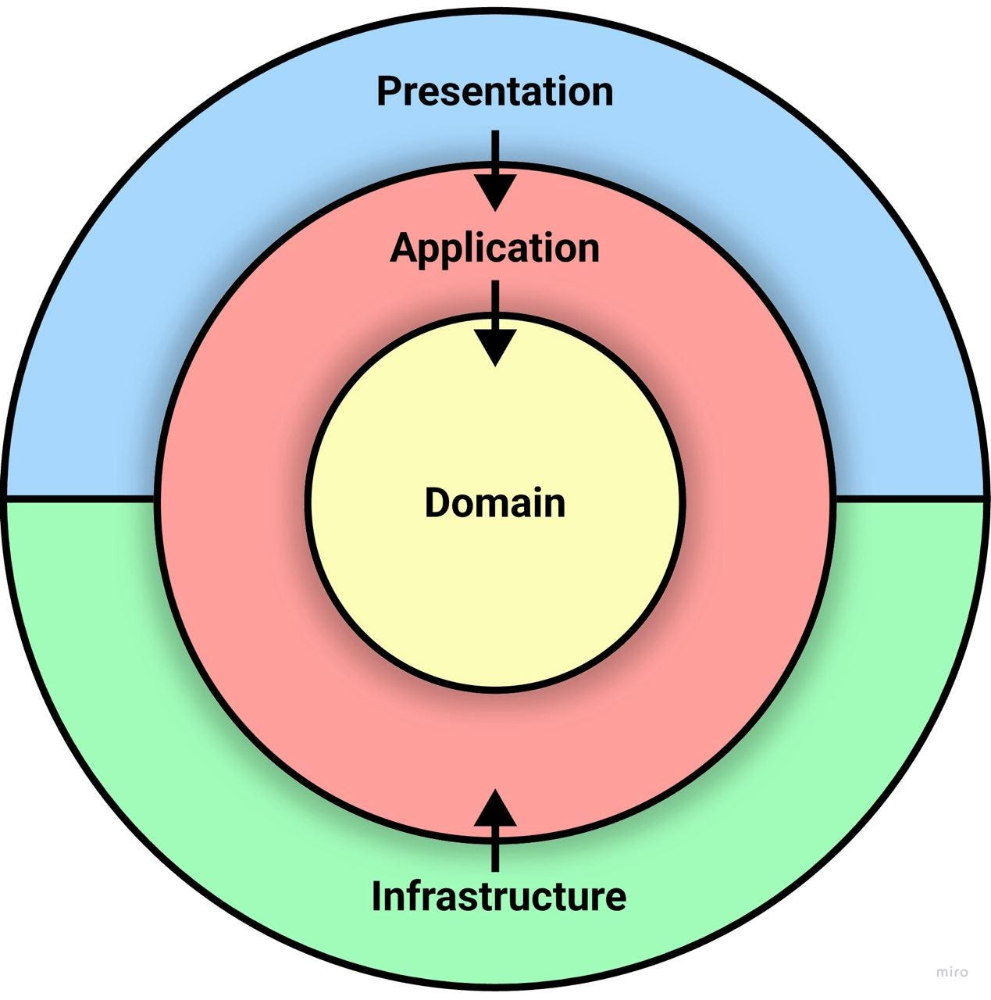
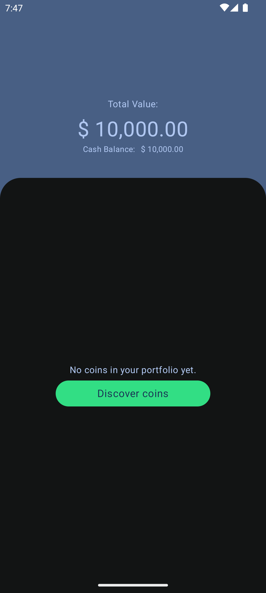
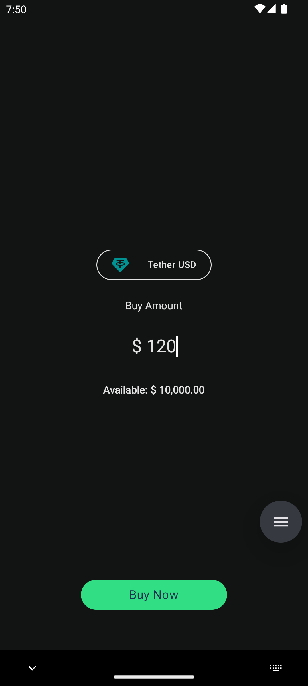
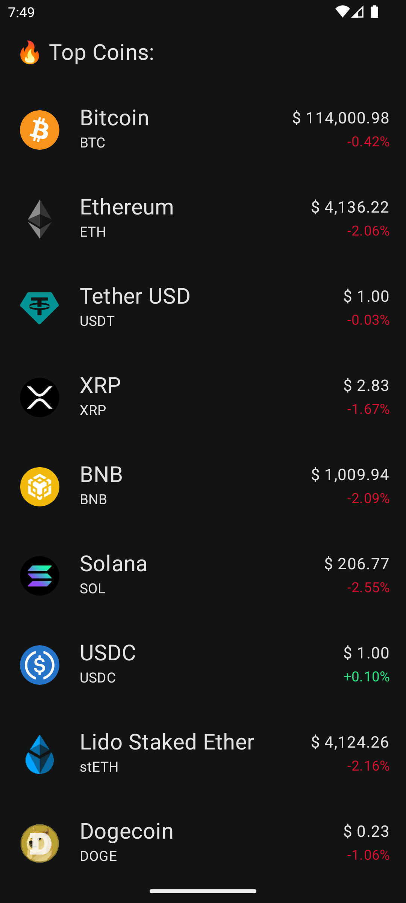
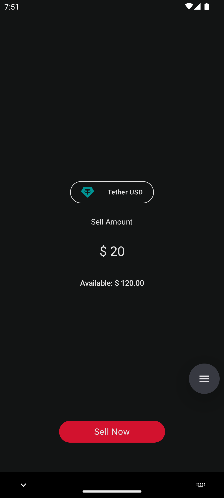
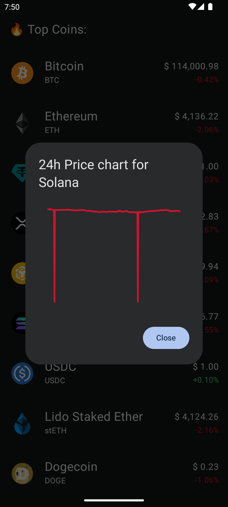
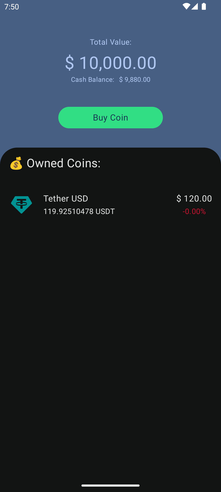

# Kind Money (Kotlin Multiplatform · Compose)

> **App de simulación de trading de criptomonedas con fines académicos.** Desarrollada con **Kotlin Multiplatform**, **Jetpack Compose**, **Material 3**, **Ktor** y **Room**.  
> Empieza con un **balance de $10,000** y practica la compra/venta de monedas en un entorno **sin riesgos reales**.  
> UI disponible en **modo claro y oscuro**, con diseño moderno y responsivo.

- El proyecto demuestra **arquitectura KMP moderna** (Compose Multiplatform, MVVM, Koin, Room, Ktor).
- Prioriza **código limpio**, **testing** y **escalabilidad multiplataforma**.
- Ideal para **aprender sobre mercados** sin arriesgar dinero real.

---

<p align="center">
  
</p>

---

## 🎬 Demo en vídeo

> Coming soon...

---

## Índice

- [📷 Capturas de pantalla](#-capturas-de-pantalla)
- [¿Qué es esta app?](#qué-es-esta-app)
- [Características principales](#características-principales)
- [Cómo funciona (flujo básico)](#cómo-funciona-flujo-básico)
- [Stack tecnológico](#stack-tecnológico)
- [Arquitectura](#arquitectura)
- [Estructura del proyecto](#estructura-del-proyecto)
- [Configuración y desarrollo local](#configuración-y-desarrollo-local)
- [Testing](#testing)
- [Roadmap](#roadmap)
- [Licencia](#licencia)

---

## 📷 Capturas de pantalla

<p align="center">
  
  
  
  
  
  
</p>


---

## ¿Qué es esta app?

**Kind Money** es una aplicación educativa de trading simulado donde puedes:

- 💰 **Empezar con $10,000** de balance virtual
- 📈 **Comprar y vender criptomonedas** en tiempo real (datos de API)
- 📊 **Ver tu portfolio** con ganancias/pérdidas actualizadas
- 📜 **Historial de transacciones** completo
- 🎓 **Aprender sin riesgos** sobre mercados financieros

El objetivo es proporcionar un **entorno seguro** para experimentar con estrategias de trading sin consecuencias económicas reales.

---

## Características principales

### 🪙 Trading Simulado
- **Compra/venta** de múltiples criptomonedas
- **Precios en tiempo real** desde APIs públicas
- **Cálculo automático** de ganancias/pérdidas

### 💼 Portfolio Management
- **Balance actual** y evolución histórica
- **Listado de tenencias** con valor actual
- **Porcentaje de ganancia/pérdida** por activo

### 📊 Market Overview
- **Lista de criptomonedas** con precios actualizados
- **Gráficos de tendencias** (24h, 7d, 30d)
- **Búsqueda y filtrado** de monedas

### 🔒 Persistencia Local
- **Room Database** para almacenar transacciones
- **DataStore** para preferencias del usuario
- **Datos offline-first** con sincronización opcional

### 🎨 Diseño Moderno
- **Material 3** Design System
- **Modo oscuro/claro** automático
- **Animaciones fluidas** con Compose
- **Responsive** para tablets y móviles

---

## Cómo funciona (flujo básico)

1. **Inicio**: La app te da $10,000 de balance inicial
2. **Explorar mercado**: Revisa los precios actuales de diferentes criptomonedas
3. **Comprar monedas**: Selecciona cantidad y confirma la compra
4. **Ver portfolio**: Observa tu inversión en tiempo real
5. **Vender monedas**: Cuando quieras, vende para obtener ganancias (o pérdidas)
6. **Historial**: Consulta todas tus transacciones pasadas

> 💡 **Todo es simulado**: Ninguna transacción real se ejecuta. Es un entorno 100% seguro para practicar.

---

## Stack tecnológico

| Categoría | Tecnología | Versión |
|-----------|-----------|---------|
| **Lenguaje** | Kotlin | `2.2.20` |
| **Build System** | Android Gradle Plugin | `8.13.0` |
| **UI Framework** | Compose Multiplatform | `1.9.0` |
| **Target SDK** | Android | `36` |
| **Min SDK** | Android | `24` |
| **DI** | Koin | `4.1.1` |
| **Networking** | Ktor Client | `3.3.0` |
| **Database** | Room | `2.8.1` |
| **Images** | Coil | `3.3.0` |
| **Serialization** | Kotlinx Serialization | `1.9.0` |
| **Testing** | JUnit, Turbine, AssertK | - |

### Dependencias clave

```toml
# Networking
ktor-client-core = "3.3.0"
ktor-client-content-negotiation = "3.3.0"

# Database
room = "2.8.1"
sqlite-bundled = "2.6.1"

# DI
koin-compose = "4.1.1"
koin-compose-viewmodel = "4.1.1"

# Images
coil-compose = "3.3.0"
coil-network-ktor = "3.3.0"

# Testing
turbine = "1.2.1"
assertk = "0.28.1"
```

---

## Arquitectura

### Patrón MVVM + Clean Architecture

```
┌─────────────────────────────────────────────────┐
│                  Presentation                   │
│  (Compose UI + ViewModels + Navigation)         │
└────────────────┬────────────────────────────────┘
                 │
┌────────────────▼────────────────────────────────┐
│                   Domain                        │
│        (Use Cases + Domain Models)              │
└────────────────┬────────────────────────────────┘
                 │
┌────────────────▼────────────────────────────────┐
│                    Data                         │
│  (Repositories + Room + Ktor + DataStore)       │
└─────────────────────────────────────────────────┘
```

### Flujo de datos

1. **UI (Composables)** → Observa StateFlow/State desde ViewModel
2. **ViewModel** → Llama a Use Cases del dominio
3. **Use Cases** → Coordinan lógica de negocio y llaman Repositories
4. **Repositories** → Deciden entre fuente local (Room) o remota (Ktor)
5. **Data Sources** → Ejecutan queries SQL o HTTP requests
6. **Flow/Result** → Propaga datos de vuelta hasta la UI

---

## Estructura del proyecto

### Arquitectura por features (Clean Architecture)

```
kindmoney/
├── composeApp/
│   ├── src/
│   │   ├── commonMain/
│   │   │   ├── kotlin/
│   │   │   │   ├── features/              # Features modulares
│   │   │   │   │   ├── coins/             # Feature: Lista y detalle de criptomonedas
│   │   │   │   │   │   ├── data/
│   │   │   │   │   │   │   ├── repository/
│   │   │   │   │   │   │   ├── remote/    # API de precios
│   │   │   │   │   │   │   └── mapper/
│   │   │   │   │   │   ├── domain/
│   │   │   │   │   │   │   ├── model/
│   │   │   │   │   │   │   ├── usecase/
│   │   │   │   │   │   │   └── repository/
│   │   │   │   │   │   └── presentation/
│   │   │   │   │   │       ├── list/      # Pantalla de mercado
│   │   │   │   │   │       ├── detail/    # Detalle de moneda
│   │   │   │   │   │       └── components/
│   │   │   │   │   │
│   │   │   │   │   ├── portfolio/         # Feature: Portfolio del usuario
│   │   │   │   │   │   ├── data/
│   │   │   │   │   │   │   ├── repository/
│   │   │   │   │   │   │   └── local/     # Room entities y DAO
│   │   │   │   │   │   ├── domain/
│   │   │   │   │   │   │   ├── model/
│   │   │   │   │   │   │   ├── usecase/   # Calcular balance, ganancias/pérdidas
│   │   │   │   │   │   │   └── repository/
│   │   │   │   │   │   └── presentation/
│   │   │   │   │   │       ├── overview/  # Vista general del portfolio
│   │   │   │   │   │       ├── holdings/  # Lista de tenencias
│   │   │   │   │   │       └── components/
│   │   │   │   │   │
│   │   │   │   │   └── trade/             # Feature: Compra/Venta
│   │   │   │   │       ├── data/
│   │   │   │   │       │   ├── repository/
│   │   │   │   │       │   └── local/     # Transacciones en Room
│   │   │   │   │       ├── domain/
│   │   │   │   │       │   ├── model/
│   │   │   │   │       │   ├── usecase/   # ExecuteTrade, ValidateBalance
│   │   │   │   │       │   └── repository/
│   │   │   │   │       └── presentation/
│   │   │   │   │           ├── buy/       # Pantalla de compra
│   │   │   │   │           ├── sell/      # Pantalla de venta
│   │   │   │   │           ├── history/   # Historial de transacciones
│   │   │   │   │           └── components/
│   │   │   │   │
│   │   │   │   ├── core/                  # Código compartido entre features
│   │   │   │   │   ├── database/
│   │   │   │   │   │   ├── KindMoneyDatabase.kt
│   │   │   │   │   │   └── DatabaseFactory.kt
│   │   │   │   │   ├── domain/
│   │   │   │   │   │   ├── Result.kt      # Sealed class para manejo de estados
│   │   │   │   │   │   └── DataError.kt   # Tipos de errores
│   │   │   │   │   ├── navigation/
│   │   │   │   │   │   ├── Navigator.kt
│   │   │   │   │   │   ├── Route.kt       # Definición de rutas
│   │   │   │   │   │   └── NavGraph.kt
│   │   │   │   │   ├── network/
│   │   │   │   │   │   ├── HttpClientFactory.kt
│   │   │   │   │   │   └── NetworkMonitor.kt
│   │   │   │   │   └── util/
│   │   │   │   │       ├── CurrencyFormatter.kt
│   │   │   │   │       ├── DateTimeFormatter.kt
│   │   │   │   │       └── PercentageCalculator.kt
│   │   │   │   │
│   │   │   │   ├── theme/                 # Tema visual
│   │   │   │   │   ├── Color.kt           # Paleta de colores
│   │   │   │   │   ├── Theme.kt           # Material 3 Theme
│   │   │   │   │   ├── Type.kt            # Tipografía
│   │   │   │   │   └── Shape.kt           # Formas personalizadas
│   │   │   │   │
│   │   │   │   └── di/                    # Inyección de dependencias
│   │   │   │       └── Module.kt          # Módulos de Koin
│   │   │   │
│   │   │   └── App.kt                     # Punto de entrada principal
│   │   │
│   │   ├── androidMain/                   # Código Android específico
│   │   │   └── kotlin/
│   │   │       ├── MainActivity.kt
│   │   │       └── KindMoneyApp.kt
│   │   │
│   │   ├── iosMain/                       # Código iOS específico (futuro)
│   │   │
│   │   └── commonTest/                    # Tests compartidos
│   │       └── kotlin/
│   │           ├── features/
│   │           │   ├── coins/
│   │           │   ├── portfolio/
│   │           │   └── trade/
│   │           └── core/
│   │
│   └── build.gradle.kts
│
├── gradle/
│   └── libs.versions.toml                 # Catálogo de versiones
├── screenshots/                           # Capturas para el README
└── README.md
```

### Organización por features

Cada feature sigue **Clean Architecture** con tres capas independientes:

#### 📊 **Feature: Coins** (Mercado de criptomonedas)
- **Data**: API client para obtener precios, mappers
- **Domain**: Modelos de monedas, use cases para filtrar/buscar
- **Presentation**: Pantallas de lista y detalle con ViewModels

#### 💼 **Feature: Portfolio** (Gestión de cartera)
- **Data**: Room DAO para holdings, cálculos de balance
- **Domain**: Lógica de ganancias/pérdidas, valoración actual
- **Presentation**: Dashboard del portfolio, lista de tenencias

#### 💱 **Feature: Trade** (Compra y venta)
- **Data**: Persistencia de transacciones en Room
- **Domain**: Validación de balance, ejecución de operaciones
- **Presentation**: Formularios de compra/venta, historial

### Módulos Core

- **database**: Configuración de Room Database y DAOs compartidos
- **domain**: Result types, error handling, modelos base
- **navigation**: Sistema de navegación con rutas type-safe
- **network**: Configuración de Ktor client y monitoreo de red
- **util**: Helpers para formateo de moneda, fechas y porcentajes

### Módulos transversales

- **theme**: Material 3 theming (colores, tipografía, formas)
- **di**: Configuración de inyección de dependencias con Koin

---

## Configuración y desarrollo local

### Requisitos previos

- **Android Studio** Ladybug | 2024.2.1 o superior
- **JDK** 17 o superior
- **Kotlin** 2.2.20
- **Android SDK** 36 (compileSdk)

### Pasos de instalación

1. **Clonar el repositorio**
   ```bash
   git clone https://github.com/clerodri/KindMoney.git
   cd kind-money
   ```

2. **Abrir en Android Studio**
    - File → Open → Selecciona la carpeta del proyecto

3. **Sincronizar Gradle**
    - Android Studio sincronizará automáticamente
    - Espera a que descargue todas las dependencias

4. **Configurar API (opcional)**
    - Si usas una API de precios real, añade tu API key en `local.properties`:
      ```properties
      CRYPTO_API_KEY=tu_api_key_aqui
      ```

5. **Ejecutar la app**
   ```bash
   ./gradlew :composeApp:installDebug
   ```
   O usa el botón ▶️ Run en Android Studio

### Configuración de Room

La base de datos se crea automáticamente en el primer inicio. Si necesitas limpiar datos:

```bash
# Android
./gradlew :composeApp:uninstallAll
```

---

## Testing

### Ejecutar tests

```bash
# Todos los tests
./gradlew test

# Tests específicos de commonMain
./gradlew :composeApp:testDebugUnitTest

# Tests de UI
./gradlew :composeApp:connectedAndroidTest
```

### Estructura de tests

```kotlin
// Ejemplo: ViewModel Test
class PortfolioViewModelTest {
    @Test
    fun `when buying crypto, balance decreases correctly`() = runTest {
        // Given
        val viewModel = PortfolioViewModel(...)
        
        // When
        viewModel.buyCrypto("BTC", amount = 1000.0)
        
        // Then
        viewModel.state.test {
            val state = awaitItem()
            assertThat(state.balance).isEqualTo(9000.0)
        }
    }
}
```

### Librerías de testing

- **JUnit 4**: Framework base
- **Turbine**: Testing de Flows
- **AssertK**: Assertions idiomáticas
- **Kotlinx Coroutines Test**: Testing de coroutines


---

## Licencia

```
Licencia de Uso para Portafolio — No Comercial v1.0

Copyright © 2025 [Tu Nombre]
Todos los derechos reservados, salvo lo permitido a continuación.

✅ PERMITIDO:
- Ver, clonar y ejecutar con fines personales, académicos o de evaluación
- Crear modificaciones privadas para aprendizaje

❌ NO PERMITIDO sin autorización:
- Uso comercial de cualquier tipo
- Redistribuir o publicar en otros repositorios
- Usar para entrenar modelos de IA
- Eliminar avisos de copyright

Este software se proporciona "TAL CUAL", sin garantías.
```

### Contacto para licencias comerciales

Si quieres usar este proyecto más allá de lo permitido (comercial, producción, etc.):

- **Email**: ronaldo_hm95@hotmail.es
- **LinkedIn**: [Tu Perfil](https://www.linkedin.com/in/clerodri/)


---


## 📝 Notas adicionales

Este proyecto demuestra:

- ✅ **Arquitectura limpia** y separación de responsabilidades
- ✅ **Kotlin Multiplatform** 
- ✅ **Compose** para UI 
- ✅ **Testing** 
- ✅ **Buenas prácticas** de desarrollo Android/KMP
- ✅ **Código mantenible** 

El enfoque en **simulación de trading** muestra capacidad para manejar:
- Estados complejos (balance, transacciones, portfolio)
- Operaciones asíncronas (API calls, database)
- Cálculos financieros precisos
- UX fluida con datos en tiempo real

---

**¿Preguntas?** contáctame directamente. ¡Gracias la visita! 🚀